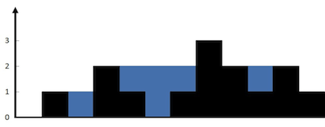

# stack and container

### 42. Trapping rain water



```cpp
class Solution {
public:
    int trap(vector<int>& height) {
        int maxContainer = 0, idx = 0;
        stack<int> st;
        
       for(int i = 0; i < height.size(); i++){
           int h = height[i];
           while(!st.empty() && h > height[st.top()]){
               int top = st.top(); st.pop();
               if(st.empty())
                   break;
               int distance = i - st.top() - 1;
               int bounded_height = min(h, height[st.top()]) - height[top];
               maxContainer += distance * bounded_height;
           }
           st.push(i);
       }
        return maxContainer;
    }
};
```

### 84. Largest rectangle in histogram


```cpp
class Solution {
public:
    int largestRectangleArea(vector<int>& heights) {
        int n = heights.size();
        if(n < 1)
            return 0;
        
        stack<int> st;
        int maxArea = 0;
        // very important to have the chance to calculate all
        heights.push_back(0);
        
        for(int i = 0; i <= n; i++){
            int h = heights[i];
    
            while(!st.empty() && h < heights[st.top()]){
                int cur = st.top(); st.pop();
                int low = st.empty()? 0 : st.top() + 1;
                maxArea = max(maxArea, heights[cur] * (i - low));
            }
                st.push(i);
        }
        return maxArea;
    }
};
```

